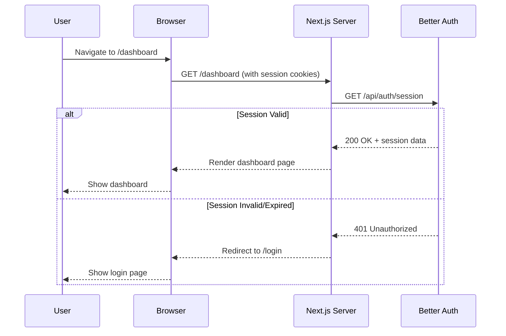
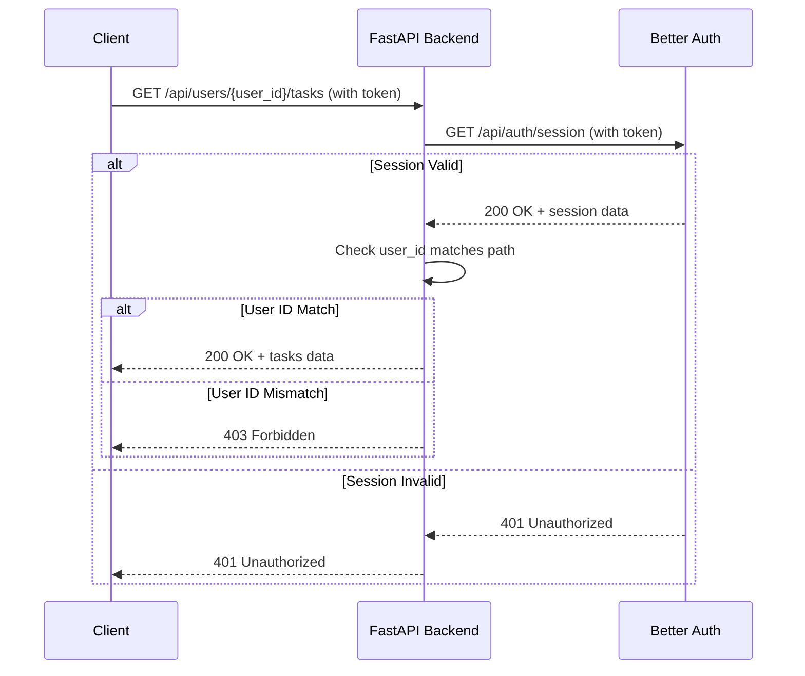

# Implementation Plan: Fix Auth Redirect Loop

**Branch**: `003-auth-security` | **Date**: 2026-02-07 | **Spec**: [spec.md](./spec.md)
**Priority**: P0 (Critical bug fix)
**Input**: Redirect loop issue after login + Session 2026-02-07 clarifications

## Summary

Fix authentication redirect loop by removing custom JWT cookie logic and replacing it with Better Auth session validation. The system will validate user sessions by calling Better Auth's `/api/auth/session` endpoint instead of manual JWT verification. Frontend dashboard protection will use server-side session checks in page components rather than middleware redirects. This eliminates conflicts between custom auth-token logic and Better Auth's native session management that are causing the redirect loop.

## Problem Statement

**Current Issue**: After successful login, users are redirected back to `/login` from `/dashboard` in an infinite loop. The session exists and is valid in Better Auth, but the middleware does not recognize it.

**Root Cause**: Conflicting authentication approaches:
1. Custom JWT cookie logic attempting to verify tokens manually
2. Middleware reading cookies directly instead of using Better Auth's session API
3. Custom `auth-token` logic conflicting with Better Auth's native session management
4. Middleware redirects interfering with Better Auth's session flow

**Solution**: Delegate all session management to Better Auth by:
1. Removing custom JWT cookie verification
2. Using Better Auth's `/api/auth/session` endpoint for validation
3. Replacing middleware checks with server-side session validation in page components
4. Establishing Better Auth as the single source of truth for authentication state

## Technical Context

**Language/Version**: TypeScript 5.x (Frontend), Python 3.13+ (Backend)
**Primary Dependencies**:
- **Frontend**: Next.js 15+ (App Router), Better Auth (session management), React 19+
- **Backend**: FastAPI, httpx (for Better Auth API calls), pydantic-settings
**Storage**: Better Auth manages session storage (delegated)
**Testing**: Jest/Vitest (frontend), pytest (backend), Playwright (E2E auth flow)
**Target Platform**: Vercel (frontend), Linux/Docker containers (backend)
**Project Type**: Web (fullstack - frontend and backend changes required)
**Performance Goals**: <100ms session validation overhead per request
**Constraints**:
- Must not break existing authenticated users during deployment
- Session validation delegated to Better Auth (not fully stateless)
- Backend calls Better Auth session endpoint for validation
- Frontend uses server-side session checks, not middleware redirects
**Scale/Scope**: Affects all protected routes and authenticated user flows

## Constitution Check

*GATE: Must pass before Phase 0 research. Re-check after Phase 1 design.*

### Principle Compliance Analysis

**I. Multi-Tier Isolation**
- ✅ **PASS**: Frontend changes in `/frontend/src/` (middleware, dashboard page components)
- ✅ **PASS**: Backend changes in `/backend/src/auth/` (session validation dependencies)
- ✅ **PASS**: Clear separation maintained between tiers via Better Auth session API

**II. Persistence First**
- ✅ **PASS**: Session persistence delegated to Better Auth (no local session storage)
- ✅ **PASS**: No changes to database schema required for this fix

**III. Secure by Design**
- ✅ **PASS**: Better Auth session endpoint provides validated session data
- ✅ **PASS**: Server-side session checks prevent unauthorized access
- ✅ **PASS**: Failed session validation returns 401, authorization failures return 403
- ⚠️ **NOTE**: Custom JWT verification removed in favor of Better Auth's proven session management

**IV. Zero Manual Coding**
- ✅ **PASS**: All code changes generated by Claude Code via `/sp.implement` workflow
- ✅ **PASS**: Every change traceable via PHR in `history/prompts/003-auth-security/`

**V. Test-First Discipline**
- ✅ **PASS**: E2E tests will verify full auth flow: login → dashboard → refresh → stay logged in
- ✅ **PASS**: Integration tests will cover session validation and redirect behavior
- ✅ **PASS**: Unit tests will validate session extraction and validation logic

**VI. API Contract Enforcement**
- ✅ **PASS**: Better Auth session API provides standardized session data structure
- ✅ **PASS**: Backend exposes consistent error responses for auth failures
- ✅ **PASS**: Frontend-backend communication via REST API remains unchanged

**Technology Standards Compliance**:
- ✅ TypeScript 5.x (frontend)
- ✅ Python 3.13+ (backend)
- ✅ Next.js 15+ App Router (frontend)
- ✅ Better Auth (session management)
- ✅ FastAPI (backend)
- ✅ pytest (backend testing)
- ✅ Playwright (E2E testing)

**Overall Gate Status**: ✅ **PASS** - All principles satisfied. This fix aligns with Secure by Design by delegating session management to Better Auth's proven implementation.

## Project Structure

### Documentation (this fix)

```text
specs/003-auth-security/
├── spec.md                      # Updated with Session 2026-02-07 clarifications
├── plan.md                      # Original JWT verification plan (deprecated)
├── plan-redirect-loop-fix.md   # This file (new plan for redirect loop fix)
├── research-redirect-fix.md     # Phase 0 output: Better Auth session API research
├── data-model.md                # Updated: Session data structure (no JWT payload)
├── quickstart.md                # Updated: Developer guide for session validation
├── contracts/                   # Phase 1 output: Updated API contracts
│   └── session-validation.json  # Better Auth session endpoint response schema
└── tasks-redirect-fix.md        # Phase 2 output (/sp.tasks command - NOT created by /sp.plan)
```

### Source Code Changes

#### Frontend (Next.js)

```text
frontend/src/
├── middleware.ts                # REMOVE or SIMPLIFY: Only check session existence, no validation
├── app/
│   ├── (auth)/
│   │   ├── login/page.tsx       # No changes needed
│   │   └── signup/page.tsx      # No changes needed
│   └── dashboard/
│       └── page.tsx             # ADD: Server-side session check via Better Auth
├── lib/
│   ├── auth/
│   │   ├── session.ts           # ADD: Better Auth session validation utilities
│   │   └── client.ts            # REMOVE: Custom JWT cookie logic
│   └── better-auth/
│       └── config.ts            # Verify Better Auth session config
└── __tests__/
    └── e2e/
        └── auth-flow.spec.ts    # ADD: E2E test for login → dashboard → refresh flow
```

#### Backend (FastAPI)

```text
backend/src/
├── auth/
│   ├── dependencies.py          # UPDATE: Call Better Auth session endpoint
│   ├── session_validator.py    # ADD: Better Auth session API client
│   ├── jwt_handler.py           # REMOVE or DEPRECATE: Manual JWT verification
│   └── exceptions.py            # UPDATE: Session validation exceptions
├── models/
│   └── auth.py                  # UPDATE: Session data models (not JWT payload)
└── config.py                    # UPDATE: BETTER_AUTH_SESSION_URL env var
backend/tests/
├── integration/
│   └── test_session_validation.py  # ADD: Test Better Auth session endpoint calls
└── unit/
    └── test_session_validator.py   # ADD: Test session data extraction
```

**Structure Decision**: Fullstack fix affecting both frontend and backend. Frontend removes middleware auth logic and adds server-side session checks. Backend replaces JWT verification with Better Auth session API calls.

## Complexity Tracking

> **Fill ONLY if Constitution Check has violations that must be justified**

No violations requiring justification. This fix actually reduces complexity by removing custom JWT verification logic and delegating to Better Auth's proven session management.

---

# Phase 0: Research

## Research Tasks

### Task 1: Better Auth Session API Integration

**Objective**: Understand Better Auth's `/api/auth/session` endpoint and how to integrate it for session validation

**Research Questions**:
- What is the exact endpoint URL format for Better Auth session validation?
- What authentication credentials does the session endpoint expect (Bearer token, cookies, both)?
- What is the response structure for valid vs invalid sessions?
- How does Better Auth handle session expiration and refresh?
- What error codes and messages does the endpoint return?
- Should we cache session validation results, or call the endpoint on every request?

**Options to Evaluate**:
- Direct API call to Better Auth session endpoint from backend
- Frontend server component calling Better Auth for session validation
- Hybrid approach: middleware checks existence, page components validate

**Decision Criteria**:
- Eliminates redirect loop
- Minimal performance overhead
- Consistent with Better Auth's recommended patterns
- Easy to test and debug

**Expected Output**: Documented decision on session validation architecture with code examples

---

### Task 2: Next.js Middleware vs Server Component Session Checks

**Objective**: Determine the correct approach for protecting Next.js routes without causing redirect loops

**Research Questions**:
- Why does middleware cause redirect loops with Better Auth sessions?
- How should server components validate sessions in Next.js 15 App Router?
- What's the difference between middleware session checks and page-level checks?
- How do we handle unauthenticated users (redirect to login) without loops?
- What's the best practice for session validation in App Router layouts vs pages?

**Options to Evaluate**:
- **Option A**: Remove middleware entirely, validate in each protected page component
- **Option B**: Minimal middleware (only check session cookie existence), validate in pages
- **Option C**: Use Next.js middleware with Better Auth helper functions

**Decision Criteria**:
- No redirect loops
- Good UX (fast redirects for unauthenticated users)
- Maintainable (easy to protect new routes)
- Follows Next.js and Better Auth best practices

**Expected Output**: Documented pattern for protecting routes with code examples

---

### Task 3: Custom JWT Logic Removal Strategy

**Objective**: Identify all custom JWT/auth-token logic and plan safe removal

**Research Questions**:
- Where is custom JWT verification code located (frontend and backend)?
- What components depend on custom auth-token logic?
- How do we migrate existing sessions without breaking active users?
- What environment variables need to be updated or removed?
- Are there any backwards compatibility concerns?

**Expected Output**: Complete inventory of custom auth code to remove with migration plan

---

## Research Output: `research-redirect-fix.md`

*This section will be filled during Phase 0 execution with consolidated research findings.*

---

# Phase 1: Design & Contracts

## Data Model Updates

### Better Auth Session Structure

```typescript
// Frontend: Expected session data from Better Auth
interface BetterAuthSession {
  user: {
    id: string;           // User ID (UUID)
    email: string;
    name?: string;
    emailVerified: boolean;
  };
  session: {
    id: string;           // Session ID
    expiresAt: string;    // ISO 8601 timestamp
    createdAt: string;
  };
}

// Backend: Python equivalent
class SessionUser(BaseModel):
    id: str
    email: EmailStr
    name: Optional[str] = None
    emailVerified: bool

class SessionData(BaseModel):
    id: str
    expiresAt: datetime
    createdAt: datetime

class BetterAuthSession(BaseModel):
    user: SessionUser
    session: SessionData
```

### Session Validation Response

```python
# Backend: Session validation result
class SessionValidationResult(BaseModel):
    is_valid: bool
    user_id: Optional[str] = None
    session_id: Optional[str] = None
    error: Optional[str] = None  # "Session expired", "Invalid session", etc.
```

## API Contracts

### Backend Session Validation Endpoint

**Note**: This is NOT a new endpoint. The backend will CALL Better Auth's session endpoint as a client.

**Better Auth Session Endpoint** (called by backend):
- **URL**: `${BETTER_AUTH_URL}/api/auth/session`
- **Method**: GET
- **Headers**:
  - `Authorization: Bearer <token>` OR
  - `Cookie: <session-cookies>`
- **Success Response (200)**:
  ```json
  {
    "user": {
      "id": "uuid-string",
      "email": "user@example.com",
      "name": "User Name",
      "emailVerified": true
    },
    "session": {
      "id": "session-uuid",
      "expiresAt": "2026-02-08T12:00:00Z",
      "createdAt": "2026-02-07T12:00:00Z"
    }
  }
  ```
- **Error Response (401)**:
  ```json
  {
    "error": "Unauthorized",
    "message": "Session expired" | "Invalid session" | "No session found"
  }
  ```

### Frontend Protected Page Pattern

```typescript
// app/dashboard/page.tsx
import { redirect } from 'next/navigation';
import { getSession } from '@/lib/auth/session';

export default async function DashboardPage() {
  const session = await getSession();

  if (!session) {
    redirect('/login');
  }

  // Session is valid, render dashboard
  return <Dashboard user={session.user} />;
}
```

### Backend FastAPI Dependency Pattern

```python
# backend/src/auth/dependencies.py
from fastapi import Depends, HTTPException, Request
from .session_validator import validate_better_auth_session

async def get_current_user(request: Request) -> SessionUser:
    """Validate session via Better Auth and return user data."""
    session_result = await validate_better_auth_session(request)

    if not session_result.is_valid:
        raise HTTPException(
            status_code=401,
            detail=session_result.error or "Authentication required"
        )

    return session_result.user

async def get_current_user_id(
    user: SessionUser = Depends(get_current_user)
) -> str:
    """Extract user ID from validated session."""
    return user.id
```

## Design Artifacts

### Frontend Session Validation Flow



### Backend Session Validation Flow



## Quickstart Updates

*Developer guide for implementing session validation will be updated in `quickstart.md` with:*
1. How to protect new Next.js pages with server-side session checks
2. How to use FastAPI session validation dependencies
3. How to test authentication flows locally
4. Environment variables required for session validation
5. Common troubleshooting steps for session issues

---

# Phase 2: Tasks (NOT generated by /sp.plan)

*Task decomposition will be generated by `/sp.tasks` command after this plan is approved.*

**Expected task categories**:
1. **Remove Custom JWT Logic** (frontend and backend)
2. **Implement Better Auth Session Validation** (backend)
3. **Update Protected Routes** (frontend - dashboard and other protected pages)
4. **Simplify/Remove Middleware** (frontend)
5. **Update Environment Variables**
6. **Write E2E Tests** (login → dashboard → refresh flow)
7. **Update Documentation** (quickstart, data-model)

---

# Risk Analysis

## Top Risks & Mitigation

### Risk 1: Better Auth Session Endpoint Performance
**Likelihood**: Medium | **Impact**: High
**Description**: Calling Better Auth session endpoint on every request may introduce latency overhead.

**Mitigation**:
- Measure session validation latency in development
- Consider short-lived session cache (5-10 seconds) if needed
- Monitor P95 latency in production
- Better Auth sessions are designed for frequent validation

### Risk 2: Breaking Active User Sessions During Deployment
**Likelihood**: Low | **Impact**: High
**Description**: Removing custom JWT logic might log out currently authenticated users.

**Mitigation**:
- Deploy backend changes first (supports both old and new session formats temporarily)
- Then deploy frontend changes
- Monitor error rates and session creation spikes
- Have rollback plan ready

### Risk 3: Middleware Removal Exposing Unprotected Routes
**Likelihood**: Low | **Impact**: Critical
**Description**: Accidentally leaving routes unprotected when removing middleware.

**Mitigation**:
- Audit all routes before removing middleware
- Add server-side session checks to ALL protected pages
- Write E2E tests covering all protected routes
- Code review checklist for route protection

---

# Success Criteria

## Verification Checklist

- ✅ User can log in successfully
- ✅ User is redirected to `/dashboard` after login (no redirect loop)
- ✅ Dashboard page renders correctly with user data
- ✅ User remains logged in after page refresh
- ✅ User can navigate between protected routes without re-authentication
- ✅ Expired sessions properly redirect to `/login`
- ✅ Backend API validates sessions via Better Auth endpoint
- ✅ Backend enforces user_id scoping (403 for cross-user access)
- ✅ All custom JWT verification code removed
- ✅ All custom `auth-token` logic removed
- ✅ E2E tests pass: login → dashboard → refresh → stay logged in
- ✅ P95 latency <200ms for protected route access

## Definition of Done

1. **Code Changes Complete**:
   - [ ] Custom JWT logic removed from frontend and backend
   - [ ] Better Auth session validation implemented in backend
   - [ ] Protected pages use server-side session checks
   - [ ] Middleware simplified or removed

2. **Testing Complete**:
   - [ ] E2E test passes for full auth flow
   - [ ] Integration tests pass for session validation
   - [ ] Unit tests pass for session extraction
   - [ ] Manual testing confirms no redirect loops

3. **Documentation Updated**:
   - [ ] `quickstart.md` updated with new session validation patterns
   - [ ] `data-model.md` updated with session structure
   - [ ] Environment variable documentation updated

4. **Deployment Ready**:
   - [ ] All tests passing in CI
   - [ ] Code reviewed and approved
   - [ ] Rollback plan documented
   - [ ] Production environment variables configured

---

# Notes

## Architectural Decisions

**Decision 1: Better Auth Session as Single Source of Truth**
- **Context**: Conflicting authentication approaches causing redirect loops
- **Decision**: Delegate all session management to Better Auth
- **Rationale**: Better Auth is designed for session management; custom logic introduces conflicts
- **Alternatives Considered**: Keep custom JWT logic alongside Better Auth (rejected - causes loops)

**Decision 2: Server-Side Session Checks Over Middleware**
- **Context**: Middleware redirects interfering with Better Auth session flow
- **Decision**: Validate sessions in page components, not middleware
- **Rationale**: Page-level checks avoid redirect loops and work better with App Router
- **Alternatives Considered**: Fix middleware logic (rejected - still causes timing issues)

**Decision 3: Remove All Custom Auth-Token Logic**
- **Context**: Custom auth-token implementation conflicts with Better Auth
- **Decision**: Complete removal of custom JWT verification
- **Rationale**: Clean slate eliminates all potential conflicts
- **Alternatives Considered**: Hybrid approach (rejected - increases complexity)

## Open Questions

- [ ] Should we cache Better Auth session validation results? If so, for how long?
- [ ] What's the exact Better Auth session endpoint URL format?
- [ ] Do we need to handle session refresh on the backend, or does Better Auth handle it?
- [ ] Should we keep any middleware for CSRF protection or rate limiting?

## Follow-up Work (Out of Scope)

- Performance optimization: Session validation caching strategy
- Observability: Add metrics for session validation latency and failure rates
- Advanced features: Role-based access control (RBAC) beyond user_id scoping
- Session management UI: Allow users to view and revoke active sessions
