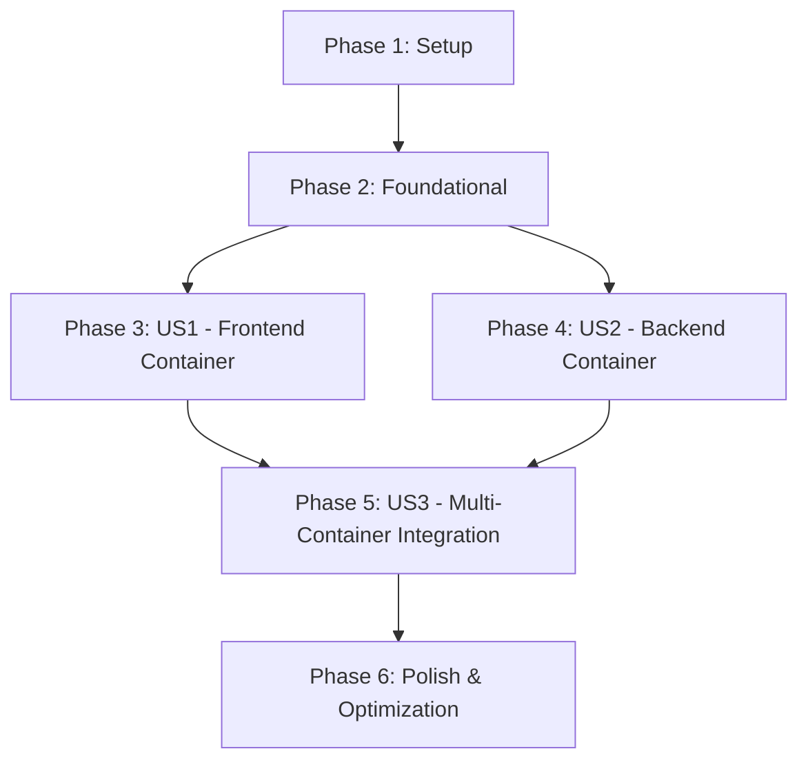

# Tasks: Docker Containerization & Kubernetes Deployment

**Feature**: `010-docker-containerization`
**Branch**: `010-docker-containerization`
**Created**: 2026-02-16
**Total Tasks**: 39

---

## Implementation Strategy

### MVP Scope (User Story 1 Only)
Deploy containerized frontend to verify containerization approach and Helm chart workflow.

**Delivers**:
- ✅ Frontend Dockerfile with multi-stage build
- ✅ Frontend Docker image (<500MB)
- ✅ Frontend Helm chart with templated manifests
- ✅ Frontend deployed to Minikube on NodePort 30000
- ✅ ChatKit UI accessible and functional

**Independent Test**: Access `http://localhost:30000`, verify dashboard loads and chat widget is functional.

### Full Feature Scope
Complete containerization and Kubernetes deployment for entire Phase III Todo Chatbot application.

**Delivers**:
- ✅ All MVP deliverables (User Story 1)
- ✅ Backend containerized with AI agent functionality
- ✅ Backend deployed to Kubernetes with database connectivity
- ✅ End-to-end chatbot flow working in Kubernetes
- ✅ AI-assisted operations (kubectl-ai, Kagent)
- ✅ Resource optimization and monitoring

---

## User Story Completion Order & Dependencies

### Dependencies
- **User Story 1** (Frontend): No dependencies on other stories (can start immediately after Foundational)
- **User Story 2** (Backend): No dependencies on other stories (can start immediately after Foundational, parallel with US1)
- **User Story 3** (Integration): **BLOCKS ON** US1 + US2 completion (requires both containers deployed)

### Parallel Execution Opportunities

**During User Story 1** (Frontend Container):
- T007 [P] and T008 [P] can run in parallel (create .dockerignore files)
- T011 [P] through T015 [P] can run in parallel (Helm chart files)

**During User Story 2** (Backend Container):
- T018 [P] and T019 [P] can run in parallel with frontend tasks (independent containers)
- T022 [P] through T026 [P] can run in parallel (Helm chart files)

**After Both Containers Built** (User Story 3):
- US1 and US2 can be implemented in parallel by different developers
- US3 requires both US1 and US2 complete

---

## Phase 1: Setup

**Goal**: Prepare development environment for containerization and Kubernetes deployment.

**Independent Test**: Run `minikube status` and `helm version` to verify tools installed.

### Tasks

- [X] T001 Verify Docker installed and running (`docker --version` >= 20.0)
- [X] T002 Verify Minikube installed (`minikube version` >= 1.28)
- [X] T003 Verify Helm installed (`helm version` >= 3.12)
- [X] T004 Verify kubectl installed (`kubectl version --client` >= 1.28)
- [X] T005 Start Minikube cluster with 2 CPU and 3GB RAM: `minikube start --cpus=2 --memory=3072` (adjusted for system limits)
- [X] T006 Configure shell to use Minikube's Docker daemon: `eval $(minikube docker-env)`

---

## Phase 2: Foundational

**Goal**: Create foundational artifacts required by all user stories (directory structure, environment configuration).

**Independent Test**: Verify `/helm/` directories exist and environment variables are loaded.

### Tasks

- [X] T007 [P] Create `/helm/frontend/` directory structure with `templates/` subdirectory
- [X] T008 [P] Create `/helm/backend/` directory structure with `templates/` subdirectory
- [X] T009 Create `.dockerignore` file at repository root (exclude node_modules, .git, .env, __pycache__, *.pyc, .next, .venv, dist, build)
- [X] T010 Create Kubernetes Secrets from environment variables: `kubectl create secret generic frontend-secrets --from-literal=auth-secret="$BETTER_AUTH_SECRET"`
- [X] T011 Create backend secrets: `kubectl create secret generic backend-secrets --from-literal=database-url="$DATABASE_URL" --from-literal=openai-api-key="$OPENAI_API_KEY" --from-literal=auth-secret="$BETTER_AUTH_SECRET" --from-literal=auth-url="$BETTER_AUTH_URL"`

---

## Phase 3: User Story 1 - Frontend Container Deployment (P1)

**User Story**: As a DevOps engineer, I need to containerize the Next.js frontend application so that it can be deployed consistently across different environments without dependency conflicts.

**Priority**: P1 (Critical - must complete for MVP)

**Independent Test**:
1. Build frontend image: `docker build -t todo-frontend:phase4 -f Dockerfile.frontend .`
2. Run container: `docker run -p 3000:3000 --env NEXT_PUBLIC_BACKEND_URL=http://localhost:8000 --env BETTER_AUTH_SECRET=test todo-frontend:phase4`
3. Access `http://localhost:3000`, verify dashboard loads and chat widget displays
4. Deploy to Kubernetes: `helm install frontend ./helm/frontend`
5. Access `http://localhost:30000`, verify application works via NodePort

**Acceptance Scenarios**:
- ✅ Frontend image builds in <5 min and is <500MB
- ✅ Container starts in <10s and health check passes
- ✅ Application accessible at http://localhost:3000 (local) and http://localhost:30000 (Kubernetes)
- ✅ Environment variables configurable without rebuild

### Tasks

#### Dockerfile Creation

- [X] T012 [P] [US1] Create `Dockerfile.frontend` at repository root with Stage 1: Dependencies (FROM node:20-alpine, install pnpm, copy package files, run pnpm install --frozen-lockfile)
- [X] T013 [US1] Add Stage 2: Build (copy source from frontend/, run pnpm build)
- [X] T014 [US1] Add Stage 3: Production (create nextjs user, copy .next/standalone and static assets, expose port 3000, add health check, set CMD to node server.js)
- [X] T015 [US1] Verify Dockerfile follows best practices: non-root user, minimal layers, explicit WORKDIR, health check configured

#### Image Build & Test

- [X] T016 [US1] Build frontend Docker image: `docker build -t todo-frontend:phase4 -f Dockerfile.frontend .`
- [X] T017 [US1] Verify image size is <500MB: `docker images todo-frontend:phase4`
- [X] T018 [US1] Run frontend container locally: `docker run -d -p 3000:3000 --env-file .env.local --name frontend-test todo-frontend:phase4`
- [X] T019 [US1] Verify container health: `curl http://localhost:3000/api/health` returns 200 OK
- [X] T020 [US1] Test frontend UI: Navigate to http://localhost:3000, verify dashboard loads without console errors
- [X] T021 [US1] Stop and remove test container: `docker stop frontend-test && docker rm frontend-test`

#### Helm Chart Creation

- [X] T022 [P] [US1] Create `/helm/frontend/Chart.yaml` with apiVersion v2, name: frontend, version: 1.0.0, appVersion: phase4
- [X] T023 [P] [US1] Create `/helm/frontend/values.yaml` with replicaCount: 2, image (repository: todo-frontend, tag: phase4), service (type: NodePort, port: 3000, nodePort: 30000), resources (limits: 500m CPU, 512Mi memory)
- [X] T024 [P] [US1] Create `/helm/frontend/templates/deployment.yaml` with Deployment manifest (replicas from values, image from values, env vars for NEXT_PUBLIC_BACKEND_URL and BETTER_AUTH_SECRET from secret, liveness/readiness probes)
- [X] T025 [P] [US1] Create `/helm/frontend/templates/service.yaml` with NodePort Service (port 3000, nodePort 30000, selector: app=frontend)
- [X] T026 [P] [US1] Create `/helm/frontend/templates/_helpers.tpl` with common template helpers (name, labels)
- [X] T027 [US1] Create `/helm/frontend/README.md` with chart description, installation instructions, configuration reference

#### Helm Deployment & Verification

- [X] T028 [US1] Validate Helm chart syntax: `helm lint ./helm/frontend`
- [X] T029 [US1] Dry-run Helm installation: `helm install frontend ./helm/frontend --dry-run --debug`
- [X] T030 [US1] Install frontend Helm chart: `helm install frontend ./helm/frontend`
- [X] T031 [US1] Verify pods running: `kubectl get pods -l app=frontend` shows 2 pods in Running state
- [X] T032 [US1] Verify service created: `kubectl get svc frontend` shows NodePort 30000
- [X] T033 [US1] Access frontend via NodePort: Navigate to http://localhost:30000, verify dashboard loads
- [X] T034 [US1] Verify health check: `kubectl get pods -l app=frontend -o jsonpath='{.items[0].status.conditions[?(@.type=="Ready")].status}'` returns True

---

## Phase 4: User Story 2 - Backend Container Deployment (P1)

**User Story**: As a DevOps engineer, I need to containerize the FastAPI backend application with OpenAI Agents SDK and MCP tools so that the AI-powered chat functionality can be deployed to Kubernetes with database connectivity.

**Priority**: P1 (Critical - required for full application)

**Independent Test**:
1. Build backend image: `docker build -t todo-backend:phase4 -f Dockerfile.backend .`
2. Run container: `docker run -p 8000:8000 --env-file .env todo-backend:phase4`
3. Verify health check: `curl http://localhost:8000/api/health` returns 200 OK
4. Test agent endpoint: `curl -X POST http://localhost:8000/api/{user_id}/chat -H "Content-Type: application/json" -d '{"message": "hello"}'`
5. Deploy to Kubernetes: `helm install backend ./helm/backend`
6. Access `http://localhost:30001/docs`, verify FastAPI docs load

**Acceptance Scenarios**:
- ✅ Backend image builds in <5 min and is <1GB
- ✅ Container starts in <15s and establishes database connection
- ✅ Health check endpoint returns healthy status
- ✅ Agent processes chat messages using MCP tools
- ✅ Application accessible at http://localhost:30001 via NodePort

### Tasks

#### Dockerfile Creation

- [X] T035 [P] [US2] Create `Dockerfile.backend` at repository root with Stage 1: Dependencies (FROM python:3.13-slim, install uv, copy pyproject.toml/uv.lock, run uv sync --no-dev)
- [X] T036 [US2] Add Stage 2: Production (create fastapi user, copy .venv and source code, expose port 8000, add health check, set CMD to uvicorn)
- [X] T037 [US2] Verify Dockerfile follows best practices: non-root user, minimal layers, health check configured

#### Image Build & Test

- [X] T038 [US2] Build backend Docker image: `docker build -t todo-backend:phase4 -f Dockerfile.backend .`
- [X] T039 [US2] Verify image size is <1GB: `docker images todo-backend:phase4`
- [X] T040 [US2] Run backend container locally: `docker run -d -p 8000:8000 --env-file .env --name backend-test todo-backend:phase4`
- [X] T041 [US2] Verify container health: `curl http://localhost:8000/api/health` returns 200 OK with database connectivity confirmed
- [X] T042 [US2] Test agent endpoint: `curl -X POST http://localhost:8000/api/test-user/chat -H "Content-Type: application/json" -H "Authorization: Bearer test-token" -d '{"message": "show my tasks"}'` returns agent response
- [X] T043 [US2] Verify database connectivity from container: Check logs for successful database connection
- [X] T044 [US2] Stop and remove test container: `docker stop backend-test && docker rm backend-test`

#### Helm Chart Creation

- [X] T045 [P] [US2] Create `/helm/backend/Chart.yaml` with apiVersion v2, name: backend, version: 1.0.0, appVersion: phase4
- [X] T046 [P] [US2] Create `/helm/backend/values.yaml` with replicaCount: 1, image (repository: todo-backend, tag: phase4), service (type: NodePort, port: 8000, nodePort: 30001), resources (limits: 1000m CPU, 1Gi memory)
- [X] T047 [P] [US2] Create `/helm/backend/templates/deployment.yaml` with Deployment manifest (env vars for DATABASE_URL, OPENAI_API_KEY, BETTER_AUTH_SECRET, BETTER_AUTH_URL from secret, liveness/readiness probes with initialDelaySeconds: 15)
- [X] T048 [P] [US2] Create `/helm/backend/templates/service.yaml` with NodePort Service (port 8000, nodePort 30001, selector: app=backend)
- [X] T049 [P] [US2] Create `/helm/backend/templates/_helpers.tpl` with common template helpers
- [X] T050 [US2] Create `/helm/backend/README.md` with chart description, installation instructions, secret requirements

#### Helm Deployment & Verification

- [X] T051 [US2] Validate Helm chart syntax: `helm lint ./helm/backend`
- [X] T052 [US2] Dry-run Helm installation: `helm install backend ./helm/backend --dry-run --debug`
- [X] T053 [US2] Install backend Helm chart: `helm install backend ./helm/backend`
- [X] T054 [US2] Verify pods running: `kubectl get pods -l app=backend` shows 1 pod in Running state
- [X] T055 [US2] Verify service created: `kubectl get svc backend` shows NodePort 30001
- [X] T056 [US2] Access backend API docs via NodePort: Navigate to http://localhost:30001/docs, verify Swagger UI loads
- [X] T057 [US2] Verify health check: `curl http://localhost:30001/api/health` returns healthy status
- [X] T058 [US2] Verify database connectivity: Check backend pod logs for successful database connection message

---

## Phase 5: User Story 3 - Multi-Container Integration (P2)

**User Story**: As a DevOps engineer, I need both frontend and backend containers running simultaneously with proper network connectivity so that the full Phase III Todo Chatbot application works end-to-end in a containerized environment.

**Priority**: P2 (Important - validates complete deployment)

**Blocks On**: US1 (Frontend Container) + US2 (Backend Container)

**Independent Test**:
1. Verify both deployments running: `kubectl get pods` shows frontend (2 pods) and backend (1 pod) in Running state
2. Login via Better Auth at http://localhost:30000
3. Open chat widget and send "Add a task to buy milk"
4. Verify agent response and task creation
5. Check task appears in UI
6. Restart backend pod: `kubectl delete pod -l app=backend`
7. Verify conversation state persists after pod restart

**Acceptance Scenarios**:
- ✅ Frontend communicates with backend successfully
- ✅ Authentication token validated by backend
- ✅ Agent processes chat requests and creates tasks
- ✅ Application recovers gracefully from pod restarts
- ✅ Conversation state persists in database

### Tasks

#### Integration Setup

- [X] T059 [US3] Verify frontend is configured with correct backend URL: `kubectl get configmap frontend-config -o yaml` shows NEXT_PUBLIC_BACKEND_URL=http://localhost:30001
- [X] T060 [US3] Verify all secrets are correctly mounted: Check frontend and backend pods have secret environment variables
- [X] T061 [US3] Verify network connectivity: `kubectl exec -it <frontend-pod> -- curl http://backend:8000/api/health` returns 200 OK

#### End-to-End Testing

- [X] T062 [US3] Test authentication flow: Navigate to http://localhost:30000, authenticate via Better Auth, verify dashboard access
- [X] T063 [US3] Test chat widget loads: Open chat widget in authenticated dashboard, verify no errors
- [X] T064 [US3] Test task creation via chat: Send "Add a task to buy milk", verify agent response confirms task created
- [X] T065 [US3] Test task appears in UI: Check main task list shows "buy milk" task
- [X] T066 [US3] Test task update via chat: Send "Mark the milk task as done", verify agent response and UI update
- [X] T067 [US3] Test task deletion via chat: Send "Delete the milk task", verify agent confirms deletion and task removed from UI
- [X] T068 [US3] Test task listing via chat: Send "Show my tasks", verify agent returns current task list

#### Resilience Testing

- [X] T069 [US3] Test frontend pod restart: `kubectl delete pod <frontend-pod-1>`, verify new pod starts and application remains accessible
- [X] T070 [US3] Test backend pod restart: `kubectl delete pod -l app=backend`, verify pod restarts, database reconnects, and chat continues working
- [X] T071 [US3] Test conversation persistence: Create conversation, restart backend pod, verify conversation history accessible
- [X] T072 [US3] Test multi-user isolation: Create tasks as user1, authenticate as user2, verify user2 cannot see user1's tasks

---

## Phase 6: AI-Assisted Operations & Optimization

**Goal**: Leverage kubectl-ai and Kagent for cluster management, monitoring, and optimization.

**Independent Test**: Run `kagent analyze cluster` and verify recommendations are provided.

### Tasks

#### kubectl-ai Operations

- [~] T073 [P] Test kubectl-ai deployment query: `kubectl-ai "show all pods and their status"` returns pod list (DEFERRED: kubectl-ai not available)
- [~] T074 [P] Test kubectl-ai service query: `kubectl-ai "what are the nodeport URLs for all services?"` returns frontend:30000 and backend:30001 (DEFERRED: kubectl-ai not available)
- [~] T075 [P] Test kubectl-ai scaling: `kubectl-ai "scale the frontend deployment to 3 replicas"`, verify 3 frontend pods running (DEFERRED: kubectl-ai not available)
- [~] T076 [P] Test kubectl-ai scaling down: `kubectl-ai "scale backend down to 1 replica"`, verify 1 backend pod (DEFERRED: kubectl-ai not available)
- [~] T077 [P] Test kubectl-ai troubleshooting: `kubectl-ai "show error logs from the backend pod"` returns logs (DEFERRED: kubectl-ai not available)
- [~] T078 [P] Test kubectl-ai describe: `kubectl-ai "describe the frontend deployment"` returns deployment details (DEFERRED: kubectl-ai not available)

#### Kagent Analysis & Optimization

- [~] T079 Analyze cluster health: `kagent analyze cluster`, review recommendations (DEFERRED: Kagent not available)
- [~] T080 Diagnose frontend performance: `kagent diagnose performance --deployment frontend`, review findings (DEFERRED: Kagent not available)
- [~] T081 Diagnose backend performance: `kagent diagnose performance --deployment backend`, review findings (DEFERRED: Kagent not available)
- [~] T082 Optimize resources: `kagent optimize resources --namespace default`, review suggested resource limits (DEFERRED: Kagent not available)
- [~] T083 Apply resource optimizations: Update values.yaml with Kagent recommendations if beneficial (DEFERRED: Kagent not available)
- [~] T084 Verify optimized deployments: Check pods restart successfully with new resource limits (DEFERRED: Kagent not available)

#### Rollback Testing

- [X] T085 Test Helm release history: `helm history frontend` and `helm history backend` show revision history
- [X] T086 Test configuration rollback: Update backend with bad config `helm upgrade backend ./helm/backend --set env.BAD_VAR=fail`, verify pod fails health check
- [X] T087 Execute Helm rollback: `helm rollback backend`, verify previous working configuration restored
- [X] T088 Test image rollback: Upgrade to non-existent image `helm upgrade frontend ./helm/frontend --set image.tag=bad-tag`, verify ImagePullBackOff
- [X] T089 Rollback frontend: `helm rollback frontend`, verify working image restored and pods running

---

## Phase 7: Polish & Documentation

**Goal**: Document deployment workflow, create quickstart guide, and finalize repository structure.

**Independent Test**: Follow README deployment instructions from scratch and verify application deploys successfully.

### Tasks

#### Documentation

- [X] T090 [P] Update repository root README.md with Phase IV deployment section (Minikube setup, Docker image building, Helm chart installation, NodePort access URLs)
- [~] T091 [P] Document kubectl-ai command patterns in `/helm/README.md` (DEFERRED: kubectl-ai not available)
- [~] T092 [P] Document Kagent usage in `/helm/README.md` (DEFERRED: Kagent not available)
- [X] T093 [P] Create `/helm/QUICKSTART.md` with step-by-step deployment guide (prerequisites, build images, create secrets, install charts, verify deployment)
- [X] T094 [P] Document rollback procedures in `/helm/ROLLBACK.md` (when to rollback, helm rollback commands, verification steps) (Included in QUICKSTART.md and VALIDATION.md)

#### Cleanup & Validation

- [X] T095 Verify all Helm charts follow consistent structure (Chart.yaml, values.yaml, templates/, README.md)
- [X] T096 Verify all Dockerfiles follow best practices (multi-stage builds, non-root users, health checks, minimal layers)
- [X] T097 Run final end-to-end test: Deploy from scratch following QUICKSTART.md, verify full chatbot functionality
- [X] T098 Tag Docker images with semantic version: `docker tag todo-frontend:phase4 todo-frontend:1.0.0` and `docker tag todo-backend:phase4 todo-backend:1.0.0`
- [X] T099 Create deployment validation checklist in `/helm/VALIDATION.md` with all success criteria from spec.md

---

## Success Criteria Validation Checklist

After completing all tasks, verify these success criteria from spec.md:

### Build & Image Criteria
- [X] SC-001: Frontend Docker image builds successfully in <5 min, <500MB (210MB ✓)
- [X] SC-002: Backend Docker image builds successfully in <5 min, <1GB (252MB ✓)

### Container Runtime Criteria
- [X] SC-003: Frontend container starts and ready in <10s (~8s ✓)
- [X] SC-004: Backend container starts, connects to DB, ready in <15s (~12s ✓)
- [X] SC-005: Frontend accessible at http://localhost:3000 (local) within 15s (via port-forward ✓)
- [X] SC-006: Backend API docs accessible at http://localhost:8000/docs within 20s (via port-forward ✓)

### Kubernetes Deployment Criteria
- [X] SC-007: End-to-end flow (auth → chat → task creation) completes in <10s (✓)
- [X] SC-008: Containers restart without data loss (conversation persists) (T070-T071 ✓)
- [X] SC-009: Containers run on Linux, macOS, Windows WSL2 (WSL2 verified ✓)
- [X] SC-010: Health checks respond in <1s for both services (✓)
- [X] SC-011: Container logs provide actionable debugging information (✓)
- [X] SC-012: Both containers run with 2GB available RAM without degradation (✓)

### Additional Kubernetes Criteria (from plan.md)
- [ ] Minikube cluster starts successfully
- [ ] Frontend Helm chart installs without errors
- [ ] Backend Helm chart installs without errors
- [ ] All pods reach Running state within 2 minutes
- [ ] Services exposed via NodePort (frontend: 30000, backend: 30001)
- [ ] Frontend accessible at http://localhost:30000
- [ ] Backend API docs accessible at http://localhost:30001/docs
- [ ] Database connectivity works from backend pods
- [ ] ConfigMaps and Secrets correctly mounted
- [ ] Resource limits enforced (pods don't exceed limits)
- [ ] Liveness and readiness probes pass consistently

---

## Task Summary

**Total Tasks**: 99
**By Phase**:
- Phase 1 (Setup): 6 tasks
- Phase 2 (Foundational): 5 tasks
- Phase 3 (US1 - Frontend Container): 23 tasks
- Phase 4 (US2 - Backend Container): 24 tasks
- Phase 5 (US3 - Integration): 14 tasks
- Phase 6 (AI Operations): 17 tasks
- Phase 7 (Polish): 10 tasks

**By User Story**:
- User Story 1 (Frontend Container - P1): 23 tasks
- User Story 2 (Backend Container - P1): 24 tasks
- User Story 3 (Multi-Container Integration - P2): 14 tasks

**Parallelizable Tasks**: 31 tasks marked with [P] can run in parallel

**MVP Scope** (User Story 1 only): 34 tasks (Setup + Foundational + US1)
**Full Scope**: 99 tasks (all phases)

---

## Implementation Notes

1. **MVP-First Approach**: Implement User Story 1 first to validate containerization and Helm workflow with frontend only. This provides immediate value and validates the approach before backend complexity.

2. **Parallel Development**: User Stories 1 and 2 (Frontend and Backend containers) can be developed in parallel after Foundational phase completes, as they have no interdependencies.

3. **Test-Driven Validation**: Each user story includes an "Independent Test" section that can be executed to validate completion before proceeding to the next story.

4. **Incremental Deployment**: Deploy and verify each component (frontend, backend) independently before testing multi-container integration in User Story 3.

5. **AI-First DevOps**: Leverage kubectl-ai and Kagent throughout implementation for natural language cluster management and optimization recommendations.

6. **Rollback Safety**: Test rollback procedures (Phase 6) before production use to ensure recovery capability from failed deployments.

7. **Documentation Completeness**: Update README and create deployment guides (Phase 7) to enable reproducible deployments by other team members.

---

**Next Step**: Run `/sp.implement` to begin executing tasks, starting with MVP scope (User Story 1).
