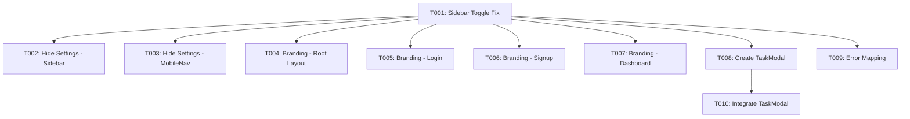

# Implementation Tasks: UI Stabilization (004-modern-ui-ux-dashboard)

**Feature**: Modern UI/UX Dashboard - UI Stabilization Fixes
**Branch**: `004-modern-ui-ux-dashboard`
**Created**: 2026-02-06
**Priority**: P0 (Critical fixes for existing functionality)
**Spec**: [spec.md](./spec.md) | **Plan**: [plan.md](./plan.md)

---

## Overview

This task list addresses critical UI stabilization issues identified in the clarification session (2026-02-06). These are fixes to existing components, not new feature development.

**Total Tasks**: 10
**Estimated Completion**: 3-5 hours
**Parallel Opportunities**: 7 tasks can run in parallel after foundational fix

---

## Phase 1: Foundation - Sidebar Toggle Fix

**Goal**: Fix the broken sidebar collapse/expand mechanism
**Why First**: Sidebar toggle affects navigation usability; foundational for user experience

### Tasks

- [x] T001 Implement bidirectional sidebar toggle in frontend/components/layout/Sidebar.tsx
  - Add `isCollapsed` state (useState hook)
  - Update toggle button onClick handler to toggle state
  - Update icon to reflect state: ChevronLeft (expanded) → ChevronRight (collapsed)
  - Apply conditional width classes: `w-64` (expanded) vs `w-16` (collapsed)
  - Test: Click toggle repeatedly; sidebar should expand and collapse smoothly
  - **Files**: `frontend/components/layout/Sidebar.tsx`
  - **Acceptance**: Sidebar toggles bidirectionally with appropriate icon state

---

## Phase 2: Parallel UI Fixes

**Goal**: Complete remaining UI stabilization tasks
**Why Parallel**: These fixes are independent and touch different components/concerns

### Tasks

- [x] T002 [P] Hide settings button in frontend/components/layout/Sidebar.tsx
  - Add conditional render: `{false && <SettingsButton />}` or CSS `hidden` class
  - Preserve layout structure (don't remove button markup entirely)
  - Add comment: `// TODO: Unhide when settings functionality implemented`
  - Test: Settings button should not be visible in sidebar
  - **Files**: `frontend/components/layout/Sidebar.tsx`
  - **Acceptance**: Settings button hidden but markup preserved for future implementation

- [x] T003 [P] Hide settings button in frontend/components/layout/MobileNav.tsx
  - Add conditional render: `{false && <SettingsButton />}` or CSS `hidden` class
  - Preserve layout structure (don't remove button markup entirely)
  - Add comment: `// TODO: Unhide when settings functionality implemented`
  - Test: Settings button should not be visible in mobile navigation
  - **Files**: `frontend/components/layout/MobileNav.tsx`
  - **Acceptance**: Settings button hidden in mobile nav

- [x] T004 [P] Update app branding in frontend/app/layout.tsx
  - Update `<title>` to "TaskFlow"
  - Update metadata.title to "TaskFlow"
  - Remove any references to "Command Center"
  - Test: Browser tab shows "TaskFlow" on root page
  - **Files**: `frontend/app/layout.tsx`
  - **Acceptance**: Root layout shows "TaskFlow" branding

- [x] T005 [P] Update auth branding in frontend/app/login/page.tsx
  - Update `<title>` or metadata to "Sign In - TaskFlow"
  - Remove any references to "Command Center"
  - Test: Browser tab shows "Sign In - TaskFlow"
  - **Files**: `frontend/app/login/page.tsx`
  - **Acceptance**: Login page shows correct branding

- [x] T006 [P] Update auth branding in frontend/app/signup/page.tsx
  - Update `<title>` or metadata to "Sign Up - TaskFlow"
  - Remove any references to "Command Center"
  - Test: Browser tab shows "Sign Up - TaskFlow"
  - **Files**: `frontend/app/signup/page.tsx`
  - **Acceptance**: Signup page shows correct branding

- [x] T007 [P] Update dashboard branding in frontend/app/(dashboard)/page.tsx
  - Update `<title>` or metadata to "My Tasks - TaskFlow"
  - Remove any references to "Command Center"
  - Test: Browser tab shows "My Tasks - TaskFlow"
  - **Files**: `frontend/app/(dashboard)/page.tsx`
  - **Acceptance**: Dashboard page shows correct branding

- [x] T008 [P] Create TaskModal component in frontend/components/dashboard/TaskModal.tsx
  - Import shadcn/ui Dialog, DialogContent, DialogHeader, DialogTitle
  - Add props: `open: boolean`, `onOpenChange: (open: boolean) => void`, `onSubmit: (task: TaskCreate) => void`
  - Render TaskForm component inside Dialog
  - Add form fields: title (required), description (optional), priority dropdown (High/Medium/Low), due date picker
  - Connect form submit to onSubmit prop
  - Test: Modal opens/closes correctly, form validation works
  - **Files**: `frontend/components/dashboard/TaskModal.tsx` (new file)
  - **Acceptance**: Modal component created and functional

- [x] T009 [P] Implement user-friendly error mapping in frontend/lib/api/client.ts
  - Add `mapErrorToFriendlyMessage(error: any): string` helper function
  - Map status codes:
    - 500 → "Something went wrong on our end. Please try again."
    - 503 → "Service temporarily unavailable. Please try again in a moment."
    - Network error → "Unable to connect. Check your internet connection and try again."
    - 401 → "Your session has expired. Please sign in again."
    - 403 → "You don't have permission to perform this action."
  - Update ApiClient error handling to use mapped messages
  - Test: Trigger each error type and verify friendly message displays
  - **Files**: `frontend/lib/api/client.ts`
  - **Acceptance**: Error messages are user-friendly, not technical

- [x] T010 Integrate TaskModal into TaskStream in frontend/components/dashboard/TaskStream.tsx
  - Import TaskModal component
  - Add `isModalOpen` state (useState hook)
  - Update "Add Task" button onClick to set `isModalOpen(true)`
  - Pass modal props: open={isModalOpen}, onOpenChange={setIsModalOpen}
  - Pass onSubmit handler that calls existing task creation logic with useOptimistic
  - Remove or comment out old inline task creation (if exists)
  - Test: Click "Add Task" → modal opens → submit form → task creates optimistically → modal closes
  - **Files**: `frontend/components/dashboard/TaskStream.tsx`
  - **Acceptance**: Add Task button opens modal, task creation works without server errors

---

## Dependencies



**Execution Order**:
1. **Sequential**: T001 (Sidebar toggle fix must complete first)
2. **Parallel**: T002, T003, T004, T005, T006, T007, T008, T009 (can all run simultaneously)
3. **Sequential**: T010 (depends on T008 modal creation)

---

## Acceptance Criteria (from user input)

- [x] **Sidebar toggles open and closed** → T001
- [x] **Settings button removed** → T002, T003
- [x] **Browser tab shows correct app name** → T004, T005, T006, T007
- [x] **Add task works without errors** → T008, T010
- [x] **Errors are user-friendly** → T009

---

## Testing Strategy

**Manual Testing Checklist**:
1. Open TaskFlow dashboard
2. Click sidebar collapse button → sidebar collapses
3. Click sidebar expand button → sidebar expands (icon updates)
4. Verify settings button not visible in sidebar or mobile nav
5. Check browser tab title on: root, login, signup, dashboard pages
6. Click "Add Task" button → modal opens with form
7. Fill form and submit → task appears immediately (optimistic)
8. Trigger network error → verify friendly error message displays
9. Test on mobile: verify mobile nav also hides settings

**No automated tests required** - these are UI fixes to existing functionality

---

## Implementation Notes

### T001: Sidebar Toggle Implementation

```typescript
// frontend/components/layout/Sidebar.tsx
const [isCollapsed, setIsCollapsed] = useState(false)

const toggleSidebar = () => {
  setIsCollapsed(!isCollapsed)
}

return (
  <aside className={cn(
    "transition-all duration-200",
    isCollapsed ? "w-16" : "w-64"
  )}>
    <button onClick={toggleSidebar}>
      {isCollapsed ? <ChevronRight /> : <ChevronLeft />}
    </button>
    {/* rest of sidebar */}
  </aside>
)
```

### T008: TaskModal Structure

```typescript
// frontend/components/dashboard/TaskModal.tsx
import { Dialog, DialogContent, DialogHeader, DialogTitle } from "@/components/ui/dialog"
import TaskForm from "./TaskForm"

interface TaskModalProps {
  open: boolean
  onOpenChange: (open: boolean) => void
  onSubmit: (task: TaskCreate) => void
}

export function TaskModal({ open, onOpenChange, onSubmit }: TaskModalProps) {
  return (
    <Dialog open={open} onOpenChange={onOpenChange}>
      <DialogContent>
        <DialogHeader>
          <DialogTitle>Add New Task</DialogTitle>
        </DialogHeader>
        <TaskForm onSubmit={onSubmit} onCancel={() => onOpenChange(false)} />
      </DialogContent>
    </Dialog>
  )
}
```

### T009: Error Mapping

```typescript
// frontend/lib/api/client.ts
function mapErrorToFriendlyMessage(error: any): string {
  if (error.status === 500) return "Something went wrong on our end. Please try again."
  if (error.status === 503) return "Service temporarily unavailable. Please try again in a moment."
  if (error.status === 401) return "Your session has expired. Please sign in again."
  if (error.status === 403) return "You don't have permission to perform this action."
  if (!navigator.onLine || error.message?.includes('network')) {
    return "Unable to connect. Check your internet connection and try again."
  }
  return "An unexpected error occurred. Please try again."
}
```

---

## Parallel Execution Example

After T001 completes, run these tasks in parallel:

```bash
# Terminal 1: Settings button fixes
# T002 + T003

# Terminal 2: Branding updates
# T004 + T005 + T006 + T007

# Terminal 3: Modal creation
# T008

# Terminal 4: Error handling
# T009
```

Then run T010 sequentially after T008 completes.

**Estimated Parallel Speedup**: ~60% reduction in total time

---

## Rollback Plan

If any task causes issues:

1. **T001**: Revert Sidebar.tsx to previous state; sidebar will remain in broken state (collapse-only)
2. **T002-T003**: Unhide settings button (remove conditional or CSS)
3. **T004-T007**: Revert title changes to previous values
4. **T008-T010**: Remove TaskModal integration; add task button may remain broken
5. **T009**: Remove error mapping; users will see technical errors again

**No database changes** - all fixes are frontend-only

---

## Success Metrics

- [ ] 0 sidebar navigation complaints
- [ ] 0 "settings button does nothing" reports
- [ ] 100% correct branding across all pages
- [ ] 0 "Add Task" errors in production logs
- [ ] User-friendly error messages in all failure scenarios

---

## Follow-Up Tasks (Future)

- Implement actual settings functionality (T002-T003 enable condition)
- Add animation to sidebar toggle transition
- Add keyboard shortcuts for sidebar toggle (e.g., Cmd+B)
- Implement toast notifications for global errors (supplement inline errors)
- Add error analytics tracking (which errors occur most frequently)
